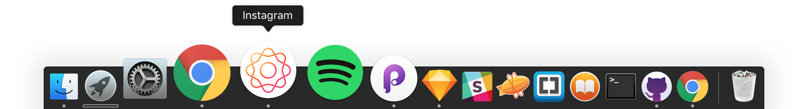

# Instagram For Mac
Instagram upload-and-view client for MacOS

App wrapper around [instagram.com](https://instagram.com). Generated with and [nativefier](https://github.com/jiahaog/nativefier).

####You can:

- [x] Upload photos (.jpg) 
- [x] Edit profile 
- [x] View feed, profile, likes
- [x] Search users, tags, places

At the moment, you can only upload .jpg photos/images. For some reason .png is not supported. 

> ## [Download it here!](https://github.com/LukaMarr/) 

  

This is not an official Instagram product. Instagram logo by amazing [Instgram Design](https://dribbble.com/instagram) crew.   

Made with ❤️ & ☕️. 